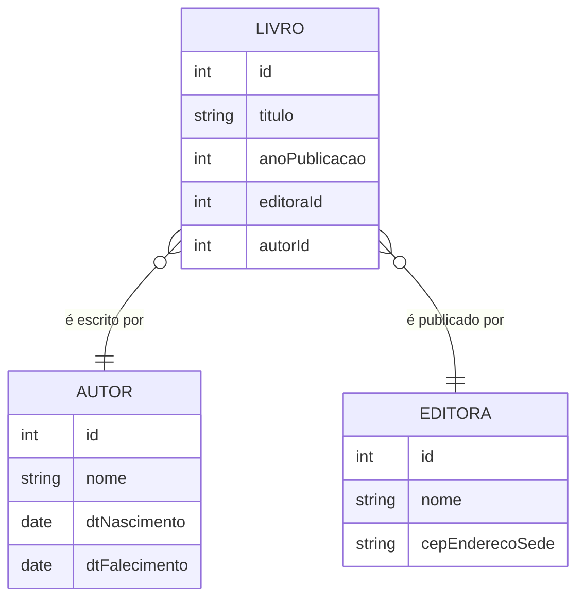

# Diagrama ER para o Sistema de Gerenciamento de Livros

```mermaid
erDiagram
    %% entities
    AUTOR {
        int id
        string nome
        date dtNascimento
        date dtFalecimento
    }
    LIVRO {
        int id
        string titulo
        int anoPublicacao
        int editoraId
        int autorId
    }
    EDITORA {
        int id
        string nome
        string cepEnderecoSede
    }

    %% relationships
    LIVRO}o--||AUTOR : "é escrito por"
    LIVRO}o--||EDITORA : "é publicado por"
```